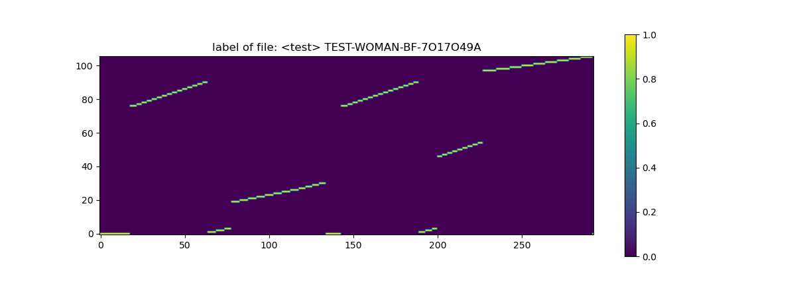
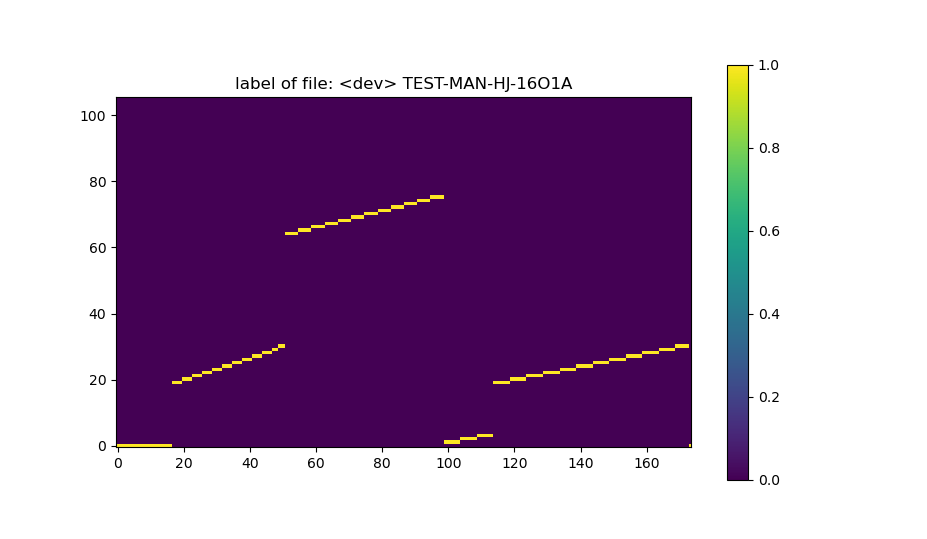

# ASE-Gruppe-4 

## Table of Contents
0. [GIT Command](#git-command)
1. [Aufgabe 1: Merkmalsextraktion I](#aufgabe-1)
2. [Aufgabe 2: Merkmalsextraktion II](#aufgabe-2)
3. [Aufgabe 3: Mel-Skalierte Dreiecksfilterbank](#aufgabe-3)
4. [Aufgabe 4: MFCCs](#aufgabe-4)
5. [Aufgabe 5: PyTorch Einführung](#aufgabe-5)
6. [Aufgabe 6: DNN-Training I - Vorbereitung der Daten](#aufgabe-6)
7. [Aufgabe 6: DNN-Training II](#aufgabe-7)

## Aufgabe 1
**Merkmalsextraktion I (Fensterung)**

<center>

<p>Figure 1: Dastellung der ersten vier Frames (mit Multiplikation mit einem
Hamming-Fenster) window_size 25ms, hop_size 10ms für TEST-MAN-AH-3O33951A.wav
</p>
</center>

---
<center>

<p>Figure 2: Dastellung der ersten vier Frames (mit Multiplikation mit einem
Hamming-Fenster) window_size 400ms, hop_size 250ms für TEST-MAN-AH-3O33951A.wav
</p>
</center>

## Aufgabe 2
**Merkmalsextraktion II (Spektralanalyse)**

<center>

<p>
Figure 3: Spektogramm für TEST-MAN-AH-3O33951A.wav
</p>
</center>


## Aufgabe 3
**Mel-Skalierte Dreiecksfilterbank**

<center>

<p>
Figure 4: Mel Dreiecksfilterbank
</p>
</center>

---
<center>

<p>
Figure 5: Mel-Spektrums für TEST-MAN-AH-3O33951A.wav
</p>
</center>

## Aufgabe 4
**MFCCs**

<center>

<p>
Figure 6: MFCC_D_DD
</p>
</center>

## Aufgabe 5
**PyTorch Einführung**

`python uebung5.py --sourcedatadir .\data\VoxCeleb_gender\`
or add the parameter to the run configuration of the IDE
> if something wrong, add env variable: `KMP_DUPLICATE_LIB_OK=TRUE` to the run configuration of the IDE
> or directly run `$env:KMP_DUPLICATE_LIB_OK="TRUE"` in windows powershell

## Aufgabe 6
**DNN-Training I - Vorbereitung der Daten**

<center>

<p>
Figure 7: Ground-Truth-Labels für das Beispiel TEST1 TEST-WOMAN-BF-7O17O49A
</p>
</center>

---
<center>

<p>
Figure 8: Ground-Truth-Labels für das Beispiel DEV1 TEST-MAN-HJ-16O1A
</p>
</center>


## Aufgabe 7
1 How to handle the **DATA** before feeding into the DNN:

| step  | file                      | input stuff                                      | output size                                               | note                                                    |
|-------|---------------------------|--------------------------------------------------|-----------------------------------------------------------|---------------------------------------------------------|
| 1     | audio data                |                                                  | len_audio_samples                                         | also give the sampling_rate(f_s)                        |
| 2     | signal_frames             | f_s + window_size + hop_size                     | num_frames(f_len), window_size_samples(frame length)      | framed signal   (windowed)                              |
| 3     | STFT: spectrum (fft)      | signal_frames                                    | num_frames(f_len), window_size_samples / 2                | absolute spec, the other half is the same(redundant)    |
| 4*    | mel filter                | f_s + window_size + n_filters                    | n_filters,  window_size_samples / 2                       | the triangle filters                                    |
| 4     | FBANK: mel spectrum (mel) | dot(fft, mel_filter.T)                           | num_frames(f_len), n_filters                              | the mel spectrum, should put a log at the end           |
| 5     | MFCC: Cepstrum (ceps)     | dct(log_mel)                                     | num_frames(f_len), num_ceps                               | just make a dct to the mel, and take the first num_ceps |
| 6     | MFCC_D                    | ceps, get_delta(ceps)                            | num_frames(f_len), 2*num_ceps                             | use caps to calculate the delta, output = caps + delta  |
| 7     | MFCC_D_DD                 | ceps, ...                                        | num_frames(f_len), 3*num_ceps                             |                                                         |
 | 8     | with context              | MFCC_D_DD(or other), left_context, right_context | num_frames(f_len), 3*num_ceps(f_dim), left+right+1(c_dim) | put context on the both side                            |

> in this lessons we sometime use f as frequency, sometime use f as frames, and even feature begins with f, very confusing and annoying <br>
> here: <br>
> f_s: sampling rate, sampling **frequency** <br>
> f_len: number of **frames** (not the length of a frame, but how many frames we made for this audio)<br>
> f_dim: **feature** dimension, how many features we have for each frame. In our case MFCC_D_DD 13*3=39 <br>
> c_dim: **context** dimension, we use 10, so it's 21=10+10+1 <br>

2 get **OUTPUT** from the DNN: <br>
now we have the input data for DNN with size (f_len, f_dim, c_dim) <br>
DataLoader will form them in batches with a specific batch_size(bs), so the input size will be (bs, f_len, f_dim, c_dim)
As required, the DNN will do the following steps:
```
(bs, f_len, f_dim, c_dim) 
-> (bs, f_len, idim)         # flatten:      idim = f_dim * c_dim
-> (bs, f_len, hidden_dim)   # go through the hidden layers
-> (bs, f_len, odim)         # output layer: odim = classes = hmm_states(use the script) = 106
```

3 read **LABEL** from dataset:<br>
the label from the dataset, if read properly, is one-hot encoded, with size (f_len, odim)<br>
To calculate cross entropy, we need to convert it to the index of the max value, with size (f_len, 1)<br>
which means, the label is a list of class_index.
```
# 
(f_len, odim)       # one-hot encoded: [[0,1,0],[1,0,0], [0,0,1], ...] means [1,0,2,...]
-> (f_len, 1)       # argmax at the second dimension(dim=2), change the one-hot to index
-> (bs, f_len, 1)   # batch will get from the DataLoader
```

4 **LOSS** function:<br>
the loss function is the cross entropy, which takes the output of the DNN and the label from the dataset(one-hot not ok). <br>
the output: (bs, f_len, odim) <br>
the label: (bs, f_len, 1) <br>
here, maybe need to swap the dim of the output (bs, odim, f_len)<br>

5 **POSTERIOR**<br>
turn the output to a posterior, the cross entropy loss function contains the softmax, so the last step we can use the output directly. <br>
but by test, the output need to be processed by softmax again.(because we don't care about the loss anymore, 
no cross entropy loss) <br>
after softmax, the numbers in each f_len[i] should sum to 1. <br> 
so the number at f_len[i]odin[j] is the probability of the hmm_state[j] at frame[i]. <br>

6 **ACCURACY** function:<br>
the output or the label mean, at f_len[i] the output class is hmm_state[j]. 
from aufgabe6.5, we see the images of labels. the x-axisi is the f_len,
the y-axis is the hmm_state. <br>
the job of the dnn is to predict the right hmm_state for each frame for each audio. <br>
and the requirement said each batch is an audio file.
so the accuracy of one batch is the match of the hmm_states between the output and the label. <br>
the accuracy of the whole dataset is the mean of all accuracy from each batch. <br>

---
## GIT Command
``` bash
## STAGE & SNAPSHOT
# add a file as it looks now to your next commit (stage)
git add [file]

# unstage a file while retaining the changes in working directory
git reset [file]

# commit your staged content as a new commit snapshot
git commit -m “[descriptive message]”


## SHARE & UPDATE
# fetch and merge any commits from the tracking remote branch
git pull

# Transmit local branch commits to the remote repository branch
git push 


## REWRITE HISTORY
# clear staging area, rewrite working tree from specified commit
git reset --hard [commit id]


## TEMPORARY COMMITS
# Save modified and staged changes
git stash

# write working from top of stash stack
git stash pop

# discard the changes from top of stash stack
git stash drop


## BRANCH & MERGE
# list your branches. a * will appear next to the currently active branch
git branch

# create a new branch at the current commit
git branch [branch-name]

# switch to another branch and check it out into your working directory
git checkout
git checkout [branch-name]

```
